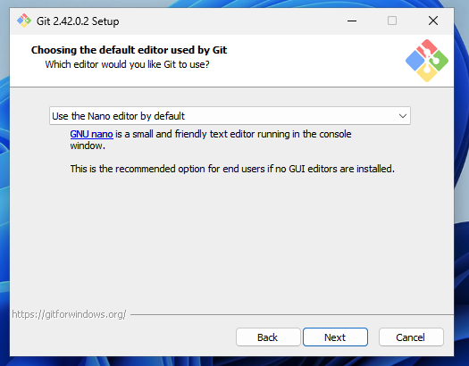
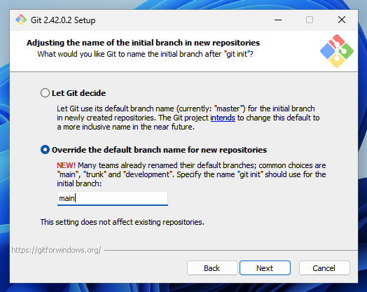
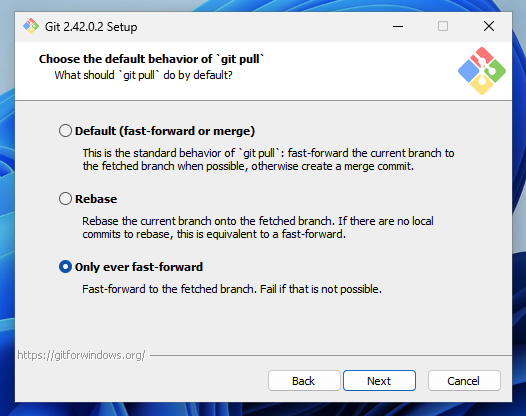
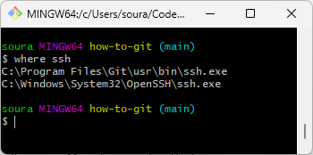
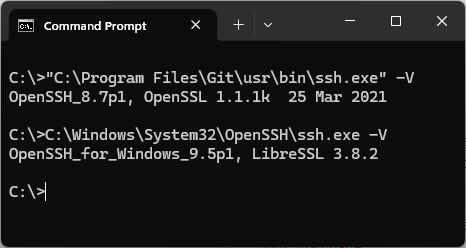
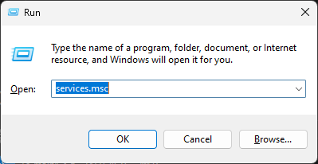
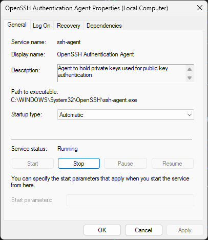
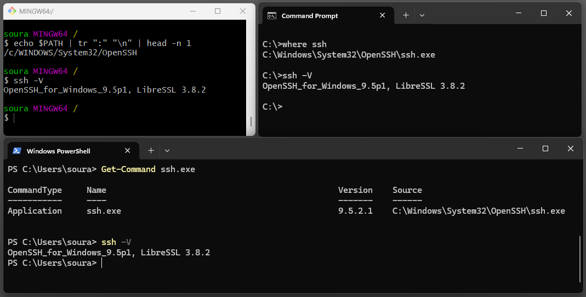

Asenna Git client: [Git for Windows](https://gitforwindows.org/). Ethän klikkaa autopilotilla `Next`-nappulaa, vaan toimit tunnollisen it-alan ammattilaisen tavoin ja luet kaikki vaihtoehdot läpi. Kiinnitä huomiota erityisesti seuraavissa kuvissa näkyviin vaihtoehtoihin. Asetukset säätävät järjestelmätason defaultteja ja tulevat kaikkiin konfiguraatiohin jatkossa defaulttina.

## Suositellut asetukset muuttaa

### Default Editor



**Kuvio 1:** *Asennus pyytä sinua valitsemaan default editorin muun muassa commit messagejen kirjoittamista varten. Vakiona tarjottu vim ei ole aloittelijoita varten. On suositeltavaa valita Nano tai esimerkiksi Notepad++ (jos on asennettuna). Nano:lla pääsee pitkälle.*

### Init branch



**Kuvio 2:** *Oletusbranchin nimi kannattaa vaihtaa vastaamaan nykypäivän standardia eli `main`. Juuri kukaan ei enää käytä sanaa master.*

### Pull FF 



**Kuvio 3:** *On suositeltavaa, että et anna Gitin luoda mergejä sinun pyytämättäsi, ellei nimenomaan fast-forward onnistu.*

### Asennuksen jälkeen

1. Käynnistä asentamisen jälkeen tietokone uusiksi.
2. Käynnistä Start-menusta Git Bash.
3. Testaa `git --version`
4. Kun ohjelmisto on asennettu, siirry lukuun [Konfiguraatio](konfiguraatio.md).

Mikäli luit asennuksen tarjoamat vaihtoehdot huolella, ja asetit sinulle sopivat (tai suositellut) asetukset, säästyt varsinaisessa konfiguraatioiden laittamisessa yllättävän helpolla.

---

## Advanced: SSH Agent 💀

!!! warning

    Tämä osio on tarkoitettu heille, jotka: 
    
    * haluavat välttyä kirjoittamasta SSH passphrasea jokaisen git- tai ssh-komennon yhteydessä uudestaan ja uudestaan
    * haluavat käyttää VS Code Dev Containers -ominaisuutta siten, että SSH toimii kontissa, mahdollistaen git-työskentelyn
    * tietävät, mikä on PATH-ympäristömuuttuja

    Jos et tiedä, mitä aiemmat rimpsut tarkoittavat, tämä loppusivu on tuskin sinua varten - sinut kenties neuvotaan tänne myöhemmissä vaiheissa opiskelua.

### Pohjustus

Aloitetaan pohjustamalla hieman, miksi tässä on niin monta vaihetta. Kun asennat Git for Windowsin, se kysyy asennuksen aikana, että:

```plaintext
[x] Use bundled OpenSSH

    This uses ssh.exe that comes with Git.

[ ] Use external OpenSSH

    NEW! This uses an external ssh.exe. Git will not install its own OpenSSH
    (and related) binaries but use them as found on PATH.
```

En ole yllä neuvonut vaihtamaan tätä asetusta toiseksi, koska :one: en halua ensimmäistä kertaa gittiä käyttäville turhaa asetustyötä, ja koska :two: muut työkalut, kuten TortoiseGit, saattavat asentaa uusia `ssh.exe`-tiedostoja `PATH`:iin muutenkin. Näinpä sinun tulee osata itse varmistaa, että git ja ssh komennot käyttävät juuri sitä binääriä, mitä sinä haluat niiden käyttävän. Ja tämähän ratkotaan tyypillisesti `PATH`-ympäristömuuttujalla, mutta toki asiaan voi vaikuttaa muutkin seikat, kuten `GIT_SSH`-ympäristömuuttuja tai Git global configit. Kurkataan vaiheittain, miten tämä tehdään. Aloitetaan kuitenkin tutustumalla siihen, mitä `where ssh`-komento kertoo ennen kuin teemme mitään muuta.



**Kuvio 4:** *Where ssh palauttaa kaikki PATH:sta löytyvät `ssh.exe`-tiedostot siinä järjestyksessä, missä ne löytyivät. Ylin ajetaan vakiona.*



**Kuvio 5:** *Huomaa, että `Program Files\`-hakemistoon asennettu OpenSSL on tyystin eri sovellus kuin `System32\`-hakemistosta löytyvä LibreSSL.*

Mitä tästä hyödymme? Microsoftin hallinnoima `ssh.exe` osaa temppuja, joita täysin avoimen lähdekoodin versio ei osaa:

- [x] Käynnistää SSH-agentin (`ssh-agent.exe`) Windowsin bootissa
- [x] Tallentaa ja noutaa avaimia sekä passphraseja Windowsin omasta backendistä

### SSH Client

Jos `where ssh`-komento ei löydä Microsoftin versiota `ssh.exe`:stä, asenna se. Klikkaa ++win+x++, valitse **System** ja sitten **Optional features**. Jos listalta ei löydy haulla **OpenSSH Clientiä**, lisää se.

### Agentti



**Kuvio 6:** *Windowsin Run-kentän avulla voi ajaa komentoja. Tällä kertaa tarvitsemme Service Managementtiä.*


**Kuvio 7:** *Services-listasta löytyy O-kirjaimen kohdalta OpenSSH Authentication Agent. Se on vakiona Disabled.*

Paina ++win+r++ ja kirjoita kenttään `services.msc`. Aukeaa Service (Management) -ikkuna, josta sinun tulee etsiä OpenSSH Authentication Agent. Näistä vaiheista on kaksi kuvaa yllä (Kuvio 6 ja 7).



**Kuvio 8:** *Vaihda agentin start-up -tilaksi Automatic ja paina Apply. Tämän jälkeen Start-nappi muuttuu klikattavaksi. Klikkaa sitä.*

OpenSSH Authentication Agent tulee aktivoida, jotta `ssh-agent.exe` on ajossa jatkossa aina Windowsin käynnistyessä. Muistutan vielä, että tässä on kyse siitä `System32/`-hakemiston alla löytyvästä `ssh-agent.exe`-tiedostosta, ja `ssh.exe`-tiedostosta joka tuota kutsuu. Ei siis siitä Git:n asentamasta. Aktivointiin näkyy ohjeet yllä olevassa kuvassa ja sen kuvatekstissä.

!!! tip

    Tämän vaiheen voi tehdä myös PowerShell-komennoilla näin:

    ```powershell
    Get-Service ssh-agent | Set-Service -StartupType Automatic
    Start-Service ssh-agent
    ```

### Tuunaa polkusi

Jos avaat Command Promptin tai PowerShellin, niin tällä hetkellä sinulla pitäisi olla tilanne, että `ssh -V` vastaa `OpenSSH_for_Windows_9.5p1, LibreSSL 3.8.2`. Testaa tämä! Jos näin ei ole, lisää `%WINDIR%\System32\OpenSSH\` Windowsin ympäristömuuttujan `PATH` ylimmäksi elementiksi.

Valitettavasti Git Bash lisää PATH-ympäristömuuttujan polkuun useita hakemistopolkuja, joista yksi (`/usr/bin/`) sisältää `ssh.exe`-tiedoston. Koska tämä polku on ennen Windowsin Environment Variableseja, et voi korjata tätä kokonaan Windowsin päästä. Tämän voi korjata ainakin kahdella tavalla:

1. Asenna Git for Windows uusiksi 😥
2. Muokkaa PATH:ia Bashin startup-tiedostossa. 🤓

Me olemme coolejä nörttejä, joten valitsemme jälkimmäisen. Aja alla näkyvä komento, joka lisää (append) rivin `PATH="/c/WINDOWS/System32/OpenSSH:$PATH` tiedoston `C:\Users\kayttajanimesi\.bashrc` loppuun. Jos et tiedä mikä tämä tiedosto on, sinulla ei ole sellaista. Tällöin komento luo tiedoston sinulle.

```bash
echo 'export PATH="/c/WINDOWS/System32/OpenSSH:$PATH"' >> ~/.bashrc
```

!!! warning

    Sulje ja avaa uusiksi Git Bash. Kyseinen `.bashrc`-tiedosto ladataan aina uuden Git Bash -istunnon yhteydessä. Bash saattaa valittaa sinulle, että se haluaa luoda `.bash_profile`-tiedoston sinulle: tätä varoitusta ei enää jatkossa tule.



**Kuvio 9:** *Lopulta on hyvä tehdä sanity check. Ssh:n pitäisi löytyä oikeasta polusta, ja vastata `ssh -V`-komentoon odotetulla tavalla kaikissa käyttämissäsi shelleissä. Kuvassa Git Bash, Command Prompt ja Windows PowerShell.*

### Agentti käyttöön

Tässä vaiheessa oletetaan, että sinulla on jo avain olemassa, ja avaimella on passphrase, ja vain on viety Kamit GitLabiin (repo.kamit.fi). Jos ei, kurkkaa [Tunnistautuminen/SSH/Avaimen Luonti](../tunnistautuminen/ssh/ssh.md) ohjeet avaimet tekemiseen. Voit kokeilla, että SSH löytää yhä avaimesi sen vakiolokaatiosta (`~/.ssh/id_{algoritmi}`) ajamalla komennon:

```bash
winpty ssh -T ssh://git@repo.kamit.fi:45065
```

!!! note

    Minulla tämä Microsoftin ssh.exe jäätyi ilman `winpty`:tä, kun se yritti kysyä passphrasea, eikä mitä ilmeisemmin saanut popuppia auki.

Mikäli ajat komennon useita kertoja, se kysyy passphrasea joka kerta. Miksi? Koska avainta ei ole lisätty agenttiin, vaikka se on ajossa. Jos kirjoitat `ssh-add -L`, se kertoo, että `The agent has no identities`. Let's fix this!

```bash
ssh-add ~/.ssh/id_ed25519
```

Kun ajat yllä olevan, passphrase kysytään sinulta viimeisen kerran. Jatkossa voit ajaa `ssh -T ssh://git@repo.kamit.fi:45065` ja `ssh.exe` löytää avaimen salasanoineen agentin muistista. Jos käynnistät koneen uusiksi, komennon `ssh-add -L` pitäisi yhä listata sinun avaimesi ja passphrasen pitäisi yhä tulla suoraan agentilta. Käytännössä voisit nyt vaikka poistaa koko `~/.ssh/id_ed25519`-tiedoston, ja SSH toimisi yhä, koska avain ladataan agentilta.

### Git

Testaa myös, että jonkin sinun repositorion kloonaaminen pelaa. Kaiken järjen mukaan tässä vaiheessa ei pitäisi tulla juurikaan ongelmia, koska git etsii ssh:ta PATH:sta - ja sehän me ollaan juuri tarkistettu kuntoon.

```bash
# Täytä urliksi jokin repositorio, mihin sinulla on oikeudet
git clone ssh://git@repo.kamit.fi:45065/some-namespace/some-repo.git
```

!!! info

    Jos kloonaus ei pelaa, voit kokeilla lisätä seuraavanlainen Git Global -konfiguraation (Huomaa nestatut heitto- ja lainasumerkit!):
    
    ```bash
    git config --global core.sshCommand "'C:\Windows\System32\OpenSSH\ssh.exe'"
    ```

    Tämän ei kuitenkaan pitäisi olla tarpeen.