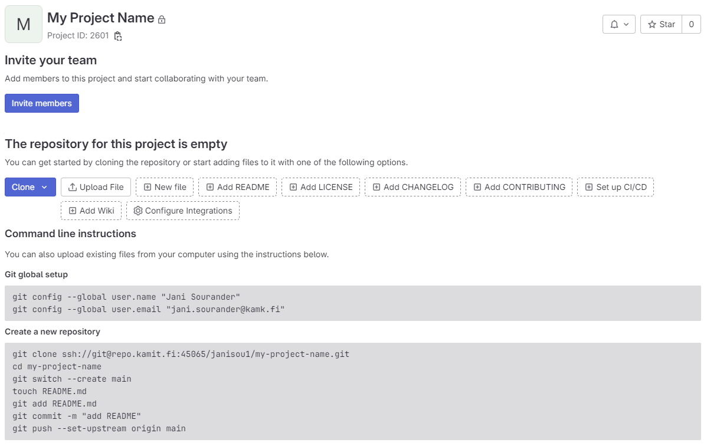
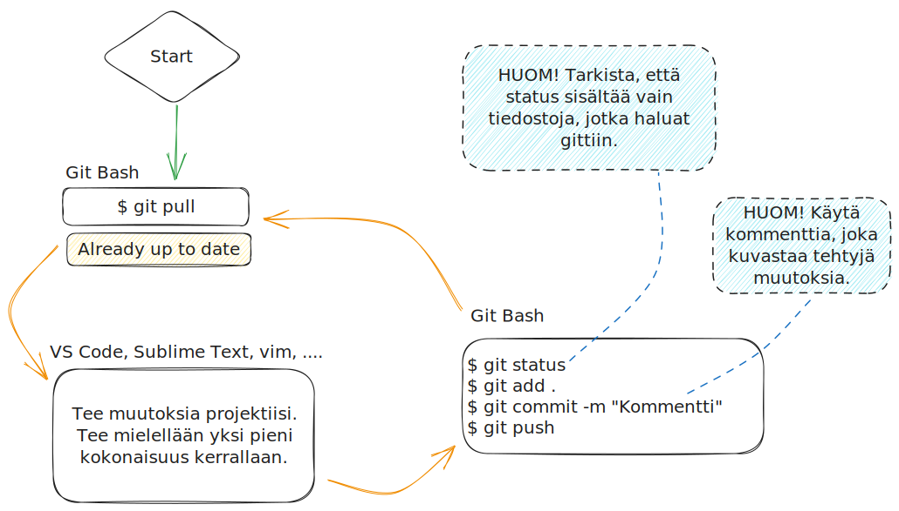

Tämän ohjeen tarkoitus on opettaa pärjäämän tilanteessa, jossa sinä olet ainut repositorion käyttäjä. Ohjeesta puuttuu tyystin git branchit, git pull requestit ja konfliktien ratkaisu.

!!! warning
    Sinulla tulee olla ssh-avain tunnistautumista varten valmiina ja lisättynä GitLabiin. Lue tämän sivuston aiemmat luvut, jotta osaat tehdä avaimen ja testata sen toiminnan.


## Repositoryn luominen

!!! warning
    Mikäli opettaja on antanut sinulle repositorion, jota kuuluu kurssilla käyttää, käytä sitä. Hyppää suoraan tämän ohjeen aliotsikkoon **"Tyhjän repositoryn täyttö"**. Muussa tapauksessa jatka ohjeen lukemista suoraan tämän rivin alta.

Mikäli sinun on ohjeistettu tekemään oma repositorio, noudata tätä ohjetta.

1. Mene [Projects · GitLab (kamit.fi)](https://repo.kamit.fi/) -sivustolle (Kamitin GitLab)
2. Kirjaudu sisään Kamit-tunnuksilla.
3. Klikkaa **"New Project"** oikeasta ylälaidasta.
4. Klikkaa **"Create blank project"**.

GitLab kysyy seuraavaksi repositorioon (eli "projektiin") liittyviä tietoja. Täytä seuraavat:

* Project name: `My Project Name`
* Project url: `http://repo.kamit.fi` + `yourusername`
* Project slug: `my-project-name` (Tämä generoituu automaattisesti. Älä koske!)
* Visibility level: `Private`
* Project configuration:
    * `[ ] Initialize repository with a README`
    * `[ ] Enable Static Application Security Testing (SAST)`

Ethän turhaan luo README-tiedostoa. Käytä projektille lyhyttä ja kuvaavaa nimeä. Yllä oleva `My Project Name` on luonnollisesti vain esimerkki. Voit lisätä sen myöhemmin itse. Kun yllä olevat asetukset on laitettu.


## Tyhjän repositoryn täyttö

Kun olet luonut repositorion, selain ohjautuu sivulle, joka edustaa repositoryn http-näkymää. Sen osoite on muotoa `https://repo.kamit.fi/xxxxxxx/my-project-name`. Ruudullasi pitäisi näkyä alla olevan kuvan mukainen ohjeteksti. `xxxxxxx`:n tilalla lukee sinun GitLab-käyttäjätunnus.



**Kuvio 1:** *GitLab, kuten myös muut vastaavat palvelut, antaa ohjetekstin mikäli repositorio on tyhjä.*

Noudatamme ohjetekstiä. Avaa **Git Bash** ja navigoi oikeaan kansioon. Alla on pikaohjeet Git Bashissä hakemistoissa navigoimiseen. Risuaidalla (`#`) alkavat rivit ovat kommentteja. Niitä ei kuulu ajaa. Rivit alkavat dollarimerkillä (`$`). Se ei ole osa komentoa vaan indikoi rivin alkua. Muut rivit esittävät tulostetta. Lue esimerkki huolella rivi riviltä!

**KOODIN LYHENTEET JA SYMBOLIT**: Alla `username` viittaa sinun Windows-käyttäjätunnukseen. `xxxxxxx` viittaa sinun GitLab-käyttäjätunnukseen. Sen näkee GitLabin tarjoamasta repositoryn osoitteesta. Aaltoviiva (`~`) on Bashissä merkki, joka tarkoittaa kotikansiotasi (esim. `/c/Users/username`).

```bash
# Tarkista, missä kansiossa olet.
$ pwd
/c/Users/username

# Luo kansio projektitiedostoja varten
# HUOM! Korvaa xxxxxxx sinun GitLab-käyttäjätunnuksellasi!
$ mkdir -p ~/Code/xxxxxxx/

# Vaihda kansioon
$ cd ~/code/xxxxxxx/

# Tarkista, missä kansiossa olet nyt.
$ pwd
/c/Users/username/code/xxxxxxx
```

Tässä vaiheessa sinun Git Bash -terminaalin työkansio on GitLab-käyttäjääsi varten tekemäsi hakemisto (`~/`). Voit aloittaa GitLabin tarjoamien koodien ajamisen yksi kerrallaan. Valitse **yksi rivi koodia** selaimessa (esim. Edge tai Chrome), paina `CTRL + C` tai valitse oikealla hiirenkorvalla Copy. Liitä rivi Git Bashiin oikealla hiirenkorvalla ja painamalla Paste, tai pikanäppäimellä `SHIFT + Ins(ert)`.


## Git: Amazing Game Loop

Jatkossa voit seurata looppia, joka toistaa aina samoja vaiheita. Tämä on kuvattuna alla olevassa kuvassa. Huomaathan, että ohjetta tulee noudattaa täsmällisesti. Mikäli jätät vaiheita tekemättä, tai teet joitakin hatusta keksittyjä vaiheita, voit joutua tilanteeseen jossa GitLabin näkemys repositoriosta (`origin/main`) ja sinun lokaali näkemys repositoriosta (`main`) eroavat. 



**Kuvio 2**: *Gitin käyttö yksin (ilman tiimityötä) looppina. Työ aloitetaan aina `git pull` ja lopetetaan `git push` komentoihin.*

Sama alla tekstimuotoisena:

```bash
# Aloita uusi päivä varmistamalla että sinun repo on samassa tilassa kuin origin/main.
# ... ja sehän on, jos noudatat ohjetta.
$ git pull
Already up to date

#####################################
# TEE MUUTOKSIA TÄSSÄ VÄLISSÄ       #
# VALITSEMALLASI TEKSTIEDITORILLA   #
#####################################

# Varmista, että status näkee haluamasi muutokset 
$ git status -u

# Lisää kaikki äsken statuksen näyttämäsi muutokset stagingiin
$ git add .

# Tee muutoksista commit
$ git commit -m "A short comment that describes the changes that were made."

# Puske muutokset GitLabiin
$ git push

#########################
# PALAA TAKAISIN ALKUUN #
#########################
```


## Mahdolliset konfliktit

Konfliktit ovat mahdollisia **vain jos et noudata ohjetta**. Konflikteja voi syntyä erityisesti silloin jos työskentelet vuoroparein kahdella tai useammalla eri tietokoneella, jolloin sinulla voi olla sama repositorio eri paikoissa eri ajassa - jos et siis ole noudattanut ohjetta. Tunnistat tämän tilanteen siitä, että `git pull` palauttaa jotakuinkin seuraavan:

```bash
$ git pull
Auto-merging some-file-name
CONFLICT (content): Merge conflict in some-file-name
Automatic merge failed; fix conflicts and then commit the result.
```

Tämä johtuu todennäköisemmin siitä, että et ole lopettanut edellistä päivää `git push`-komennolla.


## Tämän ohjeen rajoitteet

Korostan vielä, että tämä ohje on pätevä vain siinä (harvinaisen) yksinkertaisessa tilanteessa, että **sinä olet ainut henkilö joka puskee muutoksia repoon**. Tämä ei toimi ryhmätöiden kanssa. Käytä brancheja, jos tekijöitä on enemmän kuin yksi. Ryhmätyössä konflikteilta ei voi välttyä, mutta branchien käyttö helpottaa niiden ratkaisua. Yksin työskennellessä branchit ovat makuasia - ellei jokin kurssitehtävä vaadi branchien käyttöä.