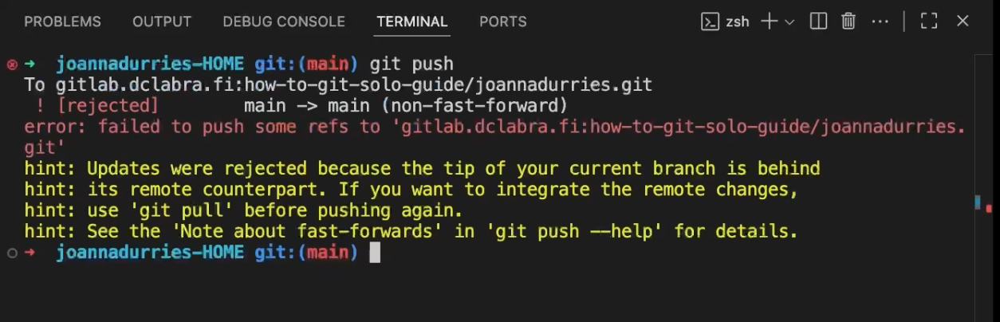

# Gitlab: Sooloilijan ohje

Tämän ohjeen tarkoitus on opettaa pärjäämän tilanteessa, jossa sinä olet ainut repositorion käyttäjä. Ohje on jaettu seuraaviin osiin, joten voit tutustua siihen osaan, mikä on sinulle nyt ajankohtainen:

1. Jos sillä koneella, jonka äärellä nyt istut, ei ole vielä paikallista kopiota työstäsi, lue [Työn aloitus](#tyon-aloitus).
2. Jos sinulla on jo paikallinen kopio työstäsi, voit siirtyä suoraan [Työn jatkaminen](#tyon-jatkaminen) -osioon.

!!! warning
    Sinulla tulee olla ssh-avain tunnistautumista varten valmiina ja lisättynä GitLabiin. Lue tämän sivuston aiemmat luvut, jotta osaat tehdä avaimen ja testata sen toiminnan.

Huomaa, että saatat aloittaa joko tyhjästä tai olemassa olevasta repositoriosta. Tämä ohje kattaa molemmat tilanteet. Klikkaa tarvittava admonition-ruutu alla auki.

## Työn aloitus

Tässä osiossa on kaksi aliotsikkoa: [Valmiin repositorion käyttö](#valmiin-repositorion-kaytto) ja [Tyhjän repositoryn käyttö](#tyhjan-repositoryn-kaytto). Valitse otsikko sen mukaan, onko sinulla jo olemassa oleva repositorio (kloonaus) vai aloitatko tyhjältä pohjalta (repositorion alustus).

#### Valmiin repositorion käyttö

??? tip "Olemassa oleva repositorio"

    Ajoittain sinulla on jo olemassa repositorio, jonka olet joko luonut toisella koneella, tai joku muu on luonut sen sinulle. Tällöin sinun tulee kloonata repositorio.

    ### Kloonaus

    Mikäli olet luonut ja testannut SSH-avaimen [ohjeiden mukaisesti](../tunnistautuminen/ssh/ssh.md). Kloonaa jokin projekti, johon sinulla on oikeudet. Älä turhaa yritä keksiä URL:ia tyhjästä, vaan: 

    1. Kirjaudu Git-palveluusi sisälle (esim. [repo.kamit.fi](https://repo.kamit.fi/))
    2. Etsi repositorio
    3. Klikkaa isoa sinistä `Clone`-näppäintä. 
    4. Kopioi ==SSH-url== leikepöydälle.

    Tämän jälkeen voit kloonata kyseisen repositorion. Voit jatkaa siitä, mihin repositorio jäi viimeksi.

    ```sh
    $ git clone ssh://git@repo.kamit.fi:<port>/<namespace>/<project>.git
    ```

    !!! warning

        Huomaathan, että URI:n on oltava jatkossa muotoa, joka alkaa `ssh://...` ! 
        
        Jos yrität kloonata `https`-alkuisella URL:lla, git pyrkii kirjautumaan sisään HTTPS:n eikä SSH:n avulla.

    Repo Kamit käyttää custom TCP-porttia, joten URL:n osatekijät ovat:

    ```txt
        user        host
        ┌─┴─┐┌────────┴──────────┐
    ssh://git@repo.kamit.fi:<port>/<namespace>/<project>.git
    └─┬──┘                        └──────────┬──────────────┘
    scheme                                  path
    ```

### Tyhjän repositoryn käyttö

??? tip "Jos opettaja ei ole antanut sinulle repositorion URL:ia"

    !!! warning
        Mikäli opettaja on antanut sinulle repositorion, jota kuuluu kurssilla käyttää, käytä sitä. Hyppää suoraan tämän ohjeen aliotsikkoon **"Tyhjän repositoryn täyttö"**. Muussa tapauksessa jatka ohjeen lukemista suoraan tämän rivin alta.

    Mikäli sinun on ohjeistettu tekemään oma repositorio, noudata tätä ohjetta.

    1. Mene [Projects · GitLab (kamit.fi)](https://repo.kamit.fi/) -sivustolle (Kamitin GitLab)
    2. Kirjaudu sisään Kamit-tunnuksilla.
    3. Klikkaa **"New Project"** oikeasta ylälaidasta.
    4. Klikkaa **"Create blank project"**.

    GitLab kysyy seuraavaksi repositorioon (eli "projektiin") liittyviä tietoja. Täytä seuraavat:

    * Project name: `My Project Name`
    * Project url: `http://repo.kamit.fi` + `yourusername`
    * Project slug: `my-project-name` (Tämä generoituu automaattisesti. Älä koske!)
    * Visibility level: `Private`
    * Project configuration:
        * `[ ] Initialize repository with a README`
        * `[ ] Enable Static Application Security Testing (SAST)`

    Ethän turhaan luo README-tiedostoa. Käytä projektille lyhyttä ja kuvaavaa nimeä. Yllä oleva `My Project Name` on luonnollisesti vain esimerkki. Voit lisätä sen myöhemmin itse. Kun yllä olevat asetukset on laitettu.

??? tip "Jos opettaja on antanut sinulle repositorion URL:n"

    Kun opettaja (tai sinä itse) on luonut tyhjän repositorion, selain ohjautuu sivulle, joka edustaa repositoryn http-näkymää. Sen osoite on muotoa `https://repo.kamit.fi/xxxxxxx/my-project-name`. Ruudullasi pitäisi näkyä alla olevan kuvan mukainen ohjeteksti. `xxxxxxx`:n tilalla lukee sinun GitLab-käyttäjätunnus.

    

    **Kuvio 1:** *GitLab, kuten myös muut vastaavat palvelut, antaa ohjetekstin mikäli repositorio on tyhjä.*

    Noudatamme ohjetekstiä. Avaa **Git Bash** ja navigoi oikeaan kansioon. Alla on pikaohjeet Git Bashissä hakemistoissa navigoimiseen. Risuaidalla (`#`) alkavat rivit ovat kommentteja. Niitä ei kuulu ajaa. Rivit alkavat dollarimerkillä (`$`). Se ei ole osa komentoa vaan indikoi rivin alkua. Muut rivit esittävät tulostetta. Lue esimerkki huolella rivi riviltä!

    **KOODIN LYHENTEET JA SYMBOLIT**: Alla `username` viittaa sinun Windows-käyttäjätunnukseen. `xxxxxxx` viittaa sinun GitLab-käyttäjätunnukseen. Sen näkee GitLabin tarjoamasta repositoryn osoitteesta. Aaltoviiva (`~`) on Bashissä merkki, joka tarkoittaa kotikansiotasi (esim. `/c/Users/username`).

    ```bash
    # Tarkista, missä kansiossa olet.
    $ pwd
    /c/Users/username

    # Luo kansio projektitiedostoja varten
    # HUOM! Korvaa xxxxxxx sinun GitLab-käyttäjätunnuksellasi!
    $ mkdir -p ~/Code/xxxxxxx/

    # Vaihda kansioon
    $ cd ~/code/xxxxxxx/

    # Tarkista, missä kansiossa olet nyt.
    $ pwd
    /c/Users/username/code/xxxxxxx
    ```

    Tässä vaiheessa sinun Git Bash -terminaalin työkansio on GitLab-käyttäjääsi varten tekemäsi hakemisto (`~/`). Voit aloittaa GitLabin tarjoamien koodien ajamisen yksi kerrallaan. Valitse **yksi rivi koodia** selaimessa (esim. Edge tai Chrome), paina `CTRL + C` tai valitse oikealla hiirenkorvalla Copy. Liitä rivi Git Bashiin oikealla hiirenkorvalla ja painamalla Paste, tai pikanäppäimellä `SHIFT + Ins(ert)`.

Kun olet joko kloonannut olemassa olevan repositorion tai luonut uuden, voit jatkaa alla olevan ohjeen seuraamista. Jatkossa sinua auttaa Amazing Game Loop, jota ==orjallisesti noudattaen== vältät konfliktit ja muut ongelmat.

## Työn jatkaminen

### Git: Amazing Game Loop

Tämän osion voisi tiivistää yhteen ohjeeseen:


**Kuvio 2**: *Gemini Pro:n (Nano Banana) näkemys 2000 vuotta ennen ajanlaskua luodusta viisaudesta.*

Jos tätä viisautta hieman avaa, niin jatkossa voit seurata looppia, jossa toistat aina samoja vaiheita. Tämä on kuvattuna alla olevassa kuvaajassa. Huomaathan, että ohjetta tulee noudattaa täsmällisesti. Mikäli jätät vaiheita tekemättä, tai teet joitakin hatusta keksittyjä vaiheita, voit joutua tilanteeseen jossa GitLabin näkemys repositoriosta (`origin/main`) ja sinun lokaali näkemys repositoriosta (`main`) eroavat. Kun nämä `git pull` ja `git push` välissä olevat vaiheet avaa, ne ovat seuraavan koodisnippetin kaltaiset:

```bash
# Aloita uusi työskentelysessio
$ git pull

#####################################
# TEE MUUTOKSIA TÄSSÄ VÄLISSÄ       #
# VALITSEMALLASI TEKSTIEDITORILLA   #
#####################################

# Varmista, että status listaa haluamasi muutokset 
$ git status -u

# Lisää kaikki muutokset indeksiin
$ git add .

# Tee muutoksista commit
$ git commit -m "A short comment that describes the changes that were made."

# Puske commit origin/main eli GitLab
$ git push

#########################
# PALAA TAKAISIN ALKUUN #
#########################
```


### Git: When Conflict Strikes Back

Konfliktit ovat mahdollisia **vain jos et noudata ohjetta**. Konflikteja voi syntyä erityisesti silloin jos työskentelet vuoroparein kahdella tai useammalla eri tietokoneella, jolloin sinulla voi olla sama repositorio eri paikoissa eri ajassa – jos et siis ole noudattanut ohjetta. Tunnistat tämän tilanteen siitä, että `git push` palauttaa jotakuinkin seuraavan:



**Kuvio 3**: *Virheilmoitus, joka ilmenee, jos `git push` epäonnistuu.*

Tämä johtuu todennäköisemmin siitä, että et ole aloittanut tuoretta päivää `git pull`-komennolla. Jos näin pääsee käymään, ==ÄLÄ PANIKOI==. Alla on upotettuna video, jossa tämä ongelma ratkaistaan seuraavin vaihein:

#### Vaiheet: Eri tiedostot

- [x] Aloitetaan repositoriosta, jossa on pelkkä `my_favorite_colors.md` -tiedosto.
- [x] Työskennellään koneella SCHOOL 🏫.
    * Luodaan uusi tiedosto: `koulussa-luotu.txt`.
    * Add + Commit + Push
- [x] Siirrytään koneelle HOME 🏡.
    * ==Unohdetaan== tehdä `git pull`
    * Muokataan `my_favorite_colors.md`-tiedostoa (johon SCHOOL 🏫 -koneella ei kajottu).
    * Add + Commit + Push → tulee varoitus
    * Korjataan tilanne: `git pull` (tai `git pull --no-ff` jos `pull.ff=only`)
    * Git ratkaisee tilanteen. Ongelma on koneelle helppo, koska tiedostot ovat eri.
    * Push onnistuu

#### Vaiheet: Päällekkäiset muutokset

- [x] Työskennellään koneella SCHOOL 🏫.
    * Muokataan tiedostoa `my_favorite_colors.md`
    * Add + Commit + Push
- [x] Siirrytään koneelle HOME 🏡.
    * ==Unohdetaan== tehdä `git pull`
    * Muokataan ==samaa tiedostoa== `my_favorite_colors.md`
    * Commit + Push → tulee konfliktivaroitus
    * Korjataan tilanne: `git pull [--no-ff]`
    * Avataan VS Coden 3-way merge editor
        - Painetaan **Resolve in Merge Editor**
        - Valitaan halutut muutokset
        - Merkitään tiedosto ratkaistuksi
        - (Toistetaan kunnes konfliktit count näyttää 0.)
    * Suoritetaan uusi Commit
    * Push onnistuu

#### Vaiheet videona

<iframe width="560" height="315" src="https://www.youtube.com/embed/_EMJkH2dzWY?si=jumzqkvbna9uyo9A" title="YouTube video player" frameborder="0" allow="accelerometer; autoplay; clipboard-write; encrypted-media; gyroscope; picture-in-picture; web-share" referrerpolicy="strict-origin-when-cross-origin" allowfullscreen></iframe>

**Video 1:** *Yllä listatut vaiheet video-oppaan muodossa.*


## Tämän ohjeen rajoitteet

Korostan vielä, että tämä ohje on pätevä vain siinä (harvinaisen) yksinkertaisessa tilanteessa, että **sinä olet ainut henkilö joka puskee muutoksia repoon**. Tämä ei toimi ryhmätöiden kanssa. Käytä brancheja, jos tekijöitä on enemmän kuin yksi. Ryhmätyössä konflikteilta ei useimmiten voi välttyä, mutta branchien käyttö helpottaa niiden ratkaisua. Yksin työskennellessä branchit ovat makuasia - ellei jokin kurssitehtävä vaadi branchien käyttöä. Tähän on erillinen ohje: [GitLab: Ryhmäkäytön ohje](./ryhmakayttaja.md)
