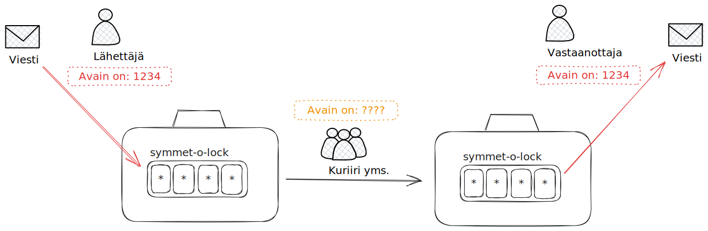
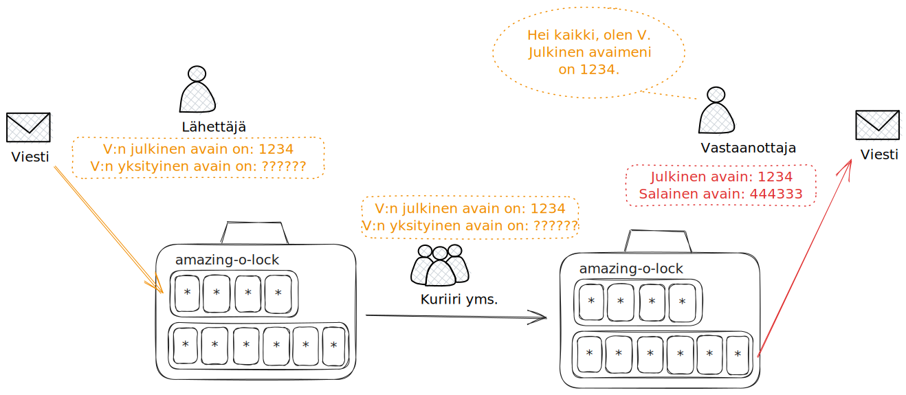

SSH-avaimia käyttäessä on hyvä ymmärtää, mitä salausavaimilla salaaminen oikeastaan tarkoittaa. ==Symmetrisessä== salauksessa sekä viestin salaajalla että purkajalla on **sama avain**. ==Asymmetrisessä salaukseen== salaaja käyttää purjalta saatua **julkista** avainta, mutta salauksen voi purkaa ainoastaan purkajan hallussa olevalla yksityisellä avaimella, joka on **eri avain**.

Myöhemmin luot `ssh-keygen`-komennolla oman asymmetrisen avainparin. Lue kuitenkin alta, mitä julkinen ja yksityinen avain oikeastaan ovat.

## Asymmetrinen salaus lyhyesti

Aloitetaan symmetrisesta avaimesta, koska se on yksinkertaisempi. Kirjeen lähettäminen numerolukollisessa salkussa on reaalimaailman analogia symmetriseen salaukseen.

**Kuvio 1:** *DALL-E 3:n näkemys numerolukollisesta salkusta postiauton kyydissä.*

Työnkulku (ks. Kuvio 2) voi mennä esimerkiksi näin: lähettäjä asettaa kirjeen salkkuun, kääntää numerolukon asentoon `1234` ja painaa `LOCK`-näppäintä. Jatkossa lukon saa auki kääntämällä numerot samaan asentoon, eli `1234`, ja painamalla `UNLOCK`-näppäintä. Lähettäjä antaa laukun kuriirille. Kuinka lähettäjä ja vastaanottaja osaavat käyttää samaa numeroa? Tämä pitää sopia toista keskustelukanavaa, kuten tekstiviestiä, käyttäen. Mikäli joku ulkopuolinen, kuten kuriiri, kaappaa tekstiviestin, ulkopuolisella ei ole mitään ongelmia avata laukkua ja lukea kirjeen sisältöä.

**Kuvio 2**: *Symmetrinen salaus selitettynä salkun numerolukon avulla. Punainen teksti edustaa salaista tietoa, keltainen julkisesti saatavilla olevaa tietoa.*

Asymmetrinen salaus toimii reaalimaailmassa hieman heikommin, mutta käytetään kuvitteellista lukkoa apuna. Kuvitellaan salkku, jossa on asymmetrinen numerolukko brändiltään `amazing-o-lock`. Numerolukossa on kaksi erillistä avainkenttää: 4-numeroinen lukitusavain ja 6-numeroinen purkuavain. Jokaista 4-numeroista lukitusavainta vastaa yksi 6-numeroinen purkuavain. Lähettäjä asettaa kirjeen salkkuun, kääntää numerolukon asentoon `1234` ja painaa `LOCK`-näppäintä. Jatkossa lukkoa **ei saa auki** samalla `1234`-numerosarjalla. Lähettäjä ei saa laatikkoa omine tietoineen enää auki. Lähettäjä antaa laukun kuriirille. Kuinka lähettäjä tietää käyttää oikeaa numeroa? Helposti. Vastaanottaja voi kailottaa oman julkisen avaimensa julkisesti koko maailmalle. Se voisi löytyä vastaanottajan nettisivuilta, käyntikortista, t-paidasta ja puhelinluettelosta. Sen sijaan **salaista avainta vastaanottaja ei luovuta kenellekään ulkopuoliselle**.

**Kuvio 3**: *Asymmetrinen salaus selitettynä salkun numerolukon avulla. Punainen teksti edustaa salaista tietoa, keltainen julkisesti saatavilla olevaa tietoa.*

!!! info

    Yllä olevissa esimerkeissä numerolukossa eli kombinaatiolukossa oli vain `4` digittiä valittavana, joten kombinaatioita löytyisi `10 potensssiin 4` eli `10,000` kappaletta. Todellisuudessa salauksessa käytettävät avaimet ovat merkittävästi monimutkaisempia. Tämän hetken parhaan käytännön eli Ed25519-salausalgoritmin arvojen avaruus on suunnilleen `57,896,044,618,658,097,711,785,492,504,343,953,926,634,992,332,820,282,019,728,792,003,956,564,819,949`.

## Kuinka monta avainta tarvitaan?

Käyttäjä voi päättää luoda useat eri avainparin tai käyttää yhtä avainparia joka käyttötarkoituksessa. Yllä olevassa salkkuesimerkissä Vastaanottaja voisi esimerkiksi käyttää Raahen osoitteessa yhtä avainparia, ja Kajaanin osoitteessa toista avainparia. Tällöin avain vastaisia **identiteettiä**, jonka määritelmä on `(henkilö + osoite)`.

Tietokoneiden kanssa ssh-avaimia voi luoda esimerkiksi yhden per käyttäjä, tai yhden per käyttäjän sähköposti, tai yhden per käyttäjän tietokone. Julkiselle avaimelle annetaan yleisesti kommentti, joten käytetään tämän kommenttikentän mahdollista arvoa selittämään eri vaihtoehdot. Näitä vaihtoehtoja ovat muiden muassa seuraavat:

* Yksi avain per henkilö:
    * Kommentti: `minä`
    * Käytät tätä yhtä avainta kotona ja koulussa aivan joka koneella. Kopioit sitä paikasta toiseen jollakin turvallisella tavalla.
* Yksi avain per sähköposti:
    * Kommentti: `nimi@kamk.fi`
    * ... tai kommentti: `nimi@example.com`.
    * Käytät yhtä avainta koulun koneilla, toista kotikoneilla.
* Yksi avain per git-palvelu:
    * Kommentti: `minä gitlab-dclab`
    * ...tai kommentti `minä gitlab-kamit`
    * Käytät eri avainta per eri GitLab palvelu. Kopioit avaimia paikasta toiseen jollakin turvallisella tavalla.
* Yksi avain per tietokone:
    * Kommentti: `nimi@kamk.fi laptop`
    * ... tai kommentti `nimi@kamk.fi TAxxLxx`
    * Luot joka tietokoneelle oman ssh-avainparin ja lisäät julkisen avaimen jokaiseen paikkaan, mihin haluat sillä koneella autentikoitua.

Ensimmäinen vaihtoehto on vähiten turvallinen, mutta käytännöllisin. Vähiten turvallisella tarkoitetaan sitä, että **mikäli avain vuotaa, sillä pääsee kaikkialle minne sinäkin pääset**. Avain voi vuotaa esimerkiksi siten, että joku Linuxin super user käyttöoikeuksin varustettu opiskelija lukee sinun `.ssh/` kansion sisällön. Mikäli samalla avaimella voi kirjautua jollekin palvelimelle, joka sisältää sinulle arkaluonteista tietoa, se saattaa joutua vääriin käsiin. Viimeinen vaihtoehto on turvallisin, mutta aiheuttaa hitusen enemmän työtä, mikäli käytät suurta määrää eri tietokoneita. Huomaathan, että aina voi keksiä turvallisemman kombon, kuten `yksi avain per tietokone per sähköposti per git-palvelu per kuukausi`.

Saat itse päättää oman turvallisuustasosi, mutta suositus on käyttää **yhtä avainta per tietokone**. Tällöin muoto on `etunimisukunimi@kamk.fi tietokone`. Syy tälle on se, että uuden tietokoneen käyttöönotto on jatkossa todella helppoa: luo avain ja lisää se käyttämääsi git-palveluun.